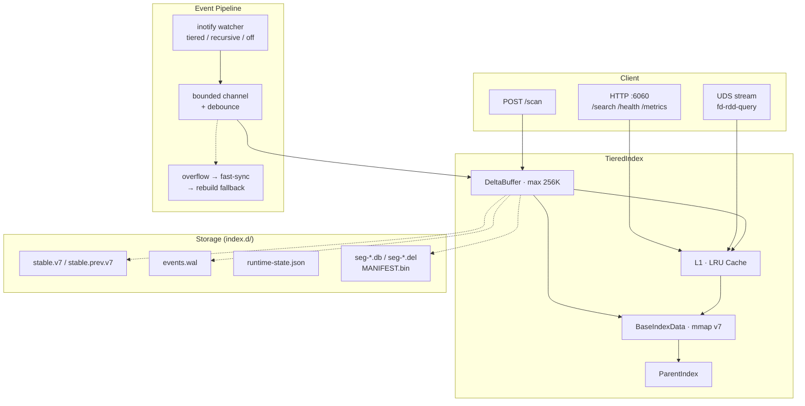

<p align="center">
  <a href="https://github.com/awei807-wei/vcp-fd-rdd/actions/workflows/ci.yml"></a>
  <a href="https://aur.archlinux.org/packages/fd-rdd-git"></a>
  <a href="LICENSE"></a>
  
</p>

<details open>
<summary><b>中文</b></summary>

## fd-rdd — Linux 文件索引守护进程

`fd-rdd` 是一个事件驱动的文件索引常驻服务：启动后扫描文件系统构建索引，之后通过 inotify 持续增量更新；对外提供 HTTP 查询接口，支持毫秒级文件名搜索。

**核心思路**：借鉴 Everything 的即时体验，但不走内核驱动路线——用 mmap 段式快照实现冷启动秒开，用 LSM（base + delta）层控制长期运行的内存与段数增长，用事件溢出补偿（fast-sync → rebuild）兜住 watcher 不可靠的现实。

- **冷启动快**：优先加载 mmap 段式快照，按需触页，不 hydration 全量索引
- **可恢复**：快照/段损坏可识别并隔离，必要时重建兜底；断电后通过 stable snapshot + WAL 回放恢复
- **长期稳定**：compaction 做物理回收；heap high-water 主动 trim；内存报告可量化 RSS 组成
- **Tiered Watcher**：预算受控的热点目录监听，避免 inotify 耗尽系统 watch 配额

当前版本 **v0.6.15** · [更新日志](CHANGELOG.md) · [编年史](fd-rdd-编年史.md)

</details>

<details>
<summary><b>English</b></summary>

## fd-rdd — Linux File Indexing Daemon

`fd-rdd` is an event-driven file indexing daemon for Linux. It scans the filesystem on startup, then maintains the index incrementally via inotify. An HTTP API serves millisecond-latency filename searches.

**Design**: Everything-like instant search, but without kernel drivers — mmap-based segment snapshots for fast cold starts, LSM (base + delta) layers to bound long-running memory and segment count, and an overflow recovery chain (fast-sync → rebuild) to handle the reality that inotify WILL drop events under load.

- **Fast cold start**: mmap segment snapshots with demand paging, no full-index hydration
- **Recoverable**: corrupted segments detected & isolated; power-off recovery via stable snapshot + WAL replay
- **Stable long-running**: compaction reclaims storage; proactive heap trim; attributed memory reports
- **Tiered Watcher**: budget-constrained hot-directory watching to avoid exhausting inotify limits

Current version **v0.6.15** · [Changelog](CHANGELOG.md) · [Chronicle](fd-rdd-编年史.md)

</details>

<details>
<summary><b>日本語</b></summary>

## fd-rdd — Linux ファイルインデックスデーモン

`fd-rdd` はイベント駆動型のファイルインデックス常駐サービスです。起動時にファイルシステムをスキャンしてインデックスを構築し、その後 inotify によって継続的に増分更新します。HTTP API でミリ秒単位のファイル名検索を提供します。

**設計思想**: Everything のような即時検索体験を、カーネルドライバに依存せず実現 — mmap セグメントスナップショットによる高速コールドスタート、LSM（base + delta）層による長期実行時のメモリとセグメント数の制御、そして inotify のイベント損失を前提とした回復チェーン（fast-sync → rebuild）。

- **高速コールドスタート**: mmap セグメントスナップショット（デマンドページング）
- **回復可能**: 破損セグメントの検出と隔離、電源断後の stable snapshot + WAL 再生による復旧
- **長期安定**: compaction による物理的回収、ヒープ高水位の積極的トリム、RSS 構成の可視化
- **Tiered Watcher**: 予算制約付きのホットディレクトリ監視、inotify 枯渇の防止

現在のバージョン **v0.6.15** · [変更履歴](CHANGELOG.md) · [年代記](fd-rdd-编年史.md)

</details>

---

## 架构 / Architecture



## 对比 / Comparison

| | fd-rdd | fd | fzf | plocate |
|---|---|---|---|---|
| 模式 | 常驻守护进程 | 一次性扫描 | 交互式过滤 | 定时 cron 更新 |
| 延迟 | 毫秒级 | 秒～分钟 | 即时（已列出文件） | 毫秒级 |
| 实时性 | inotify 增量 | 每次重新扫描 | 手动 | 每天更新 |
| 内存 | ~100MB（稳态） | 无驻留 | 无驻留 | ~100MB（mlocate DB） |
| 查询语法 | DSL（AND/OR/NOT/glob/regex/fuzzy） | regex/glob | fuzzy | glob |
| 恢复 | WAL + stable snapshot | — | — | — |
| 适用场景 | 日常即时搜索 | 一次性精确搜索 | 终端交互 | 系统级 locate |

## 快速开始 / Quick Start

<details open>
<summary><b>Arch Linux · AUR</b></summary>

```bash
yay -S fd-rdd-git
```

二进制：`fd-rdd`（守护进程）、`fd-rdd-query`（UDS 查询客户端）

</details>

<details>
<summary><b>源码编译 / Build from Source</b></summary>

```bash
# 默认启用 mimalloc
cargo build --release

# 系统分配器
cargo build --release --no-default-features
```

一键安装到 `~/.vcp/bin/`：

```bash
bash scripts/install.sh
```

</details>

<details>
<summary><b>systemd User Service</b></summary>

```bash
mkdir -p ~/.config/systemd/user/
cp scripts/fd-rdd.service ~/.config/systemd/user/
systemctl --user enable --now fd-rdd
```

服务文件预设 `CPUQuota=80%`、`MemoryMax=512M`，可按需调整。

</details>

**首次启动**：

```bash
fd-rdd --root ~
```

首次启动必须传 `--root`，配置会自动保存到 `~/.config/fd-rdd/config.toml`。之后直接 `fd-rdd` 即可。

**搜索**：

```bash
# HTTP
curl "http://127.0.0.1:6060/search?q=main.rs&limit=20"

# fuzzy 模式
curl "http://127.0.0.1:6060/search?q=mdt&mode=fuzzy&limit=20"

# UDS 流式（大结果集推荐）
fd-rdd-query --limit 2000 "*.rs"
```

## 配置 / Configuration

`~/.config/fd-rdd/config.toml`（首次启动自动生成）：

| 字段 | 类型 | 默认值 | 说明 |
|---|---|---|---|
| `roots` | `[PathBuf]` | `[]` | 索引根目录 |
| `http_port` | `u16` | `6060` | HTTP 查询端口 |
| `include_hidden` | `bool` | `false` | 索引隐藏文件 |
| `follow_symlinks` | `bool` | `false` | 跟随符号链接 |
| `ignore_enabled` | `bool` | `true` | `.gitignore` 规则 |
| `watch_enabled` | `bool` | `true` | 启用文件监听 |
| `watch_mode` | `String` | `"recursive"` | `recursive` / `tiered` / `off` |
| `snapshot_interval_secs` | `u64` | `300` | 快照落盘周期 |
| `stable_snapshot_enabled` | `bool` | `true` | 稳定快照轮转 |
| `startup_repair_enabled` | `bool` | `true` | 启动修复扫描 |
| `log_level` | `String` | `"info"` | trace / debug / info / warn / error |

优先级：`CLI 参数 > config.toml > 默认值`。查看生效配置：

```bash
fd-rdd --show-config
```

## 查询语法 / Query Syntax

### 匹配模式

| 模式 | 示例 | 说明 |
|---|---|---|
| 子串（默认） | `server` | contains 匹配 |
| Glob | `*.rs` / `*memoir*` | `*` `?` 通配 |
| Fuzzy | `mdt` (mode=fuzzy) | fzf 风格模糊匹配 |
| 正则 | `regex:"^VCP.*\\.js$"` | Rust regex |
| 完整文件名 | `wfn:main.rs` | 精确文件名匹配 |
| 路径段首 | `c/use/sh` | 自动匹配 `/home/user/shiyi/...` |

### 运算符

| 运算符 | 示例 | 说明 |
|---|---|---|
| AND | `VCP server` | 默认（空格） |
| OR | `js\|ts` | 竖线分隔 |
| NOT | `!node_modules` | 全局排除 |
| 短语 | `"New Folder"` | 双引号 |

### 过滤器

| 过滤器 | 示例 | 说明 |
|---|---|---|
| `parent:` / `infolder:` | `parent:/home/user/Downloads` | 父目录匹配 |
| `ext:` | `ext:rs;py` | 后缀过滤 |
| `size:` | `size:>10mb` | 大小（b/kb/mb/gb） |
| `dm:` / `dc:` / `da:` | `dm:today` / `dc:2024-01-01` | 修改/创建/访问日期 |
| `depth:` | `depth:<=3` | 路径深度 |
| `type:` | `type:file` | 文件类型 |
| `doc:` / `pic:` / `video:` | `pic:十一` | 按扩展名集合 |
| `len:` | `len:>50` | 文件名字节长度 |

### 排序

```
sort=score | name | path | size | ext | date_modified | date_created | date_accessed
```

### Smart Case

- 默认不区分大小写
- query 含大写 → 自动切换大小写敏感
- `case:sensitive` / `case:insensitive` 显式指定

## API 端点 / Endpoints

| 端点 | 方法 | 说明 |
|---|---|---|
| `/search` | GET | 搜索查询 |
| `/scan` | POST | 即时扫描指定目录 |
| `/health` | GET | 健康检查（含恢复状态、watch 状态） |
| `/status` | GET | 索引统计（文件数、重建状态） |
| `/metrics` | GET | 运行计数（查询/事件/snapshot） |
| `/memory` | GET | 内存归因（RSS/smaps/索引拆项） |
| `/watch-state` | GET | Watcher 控制面状态 |
| `/trim` | GET/POST | 手动触发内存 trim |

## 索引文档

| 文档 | 内容 |
|---|---|
| [CHANGELOG.md](CHANGELOG.md) | 版本更新日志 |
| [BENCHMARK.md](BENCHMARK.md) | 基准数据 |
| [fd-rdd-编年史.md](fd-rdd-编年史.md) | 项目开发历史与架构决策 |
| [tests/README.md](tests/README.md) | 测试集说明 |

## 许可证 / License

MIT · [LICENSE](LICENSE)
