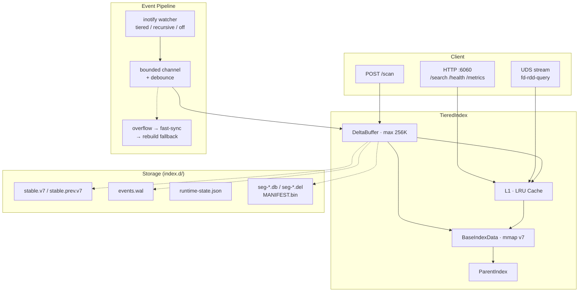

<p align="center">
  <a href="https://github.com/awei807-wei/vcp-fd-rdd/actions/workflows/ci.yml"></a>
  <a href="https://aur.archlinux.org/packages/fd-rdd-git"></a>
  <a href="LICENSE"></a>
  
</p>

<details open>
<summary><b>中文</b></summary>

## fd-rdd — Linux 文件索引守护进程

`fd-rdd` 是一个事件驱动的文件索引常驻服务：启动后扫描文件系统构建索引，之后通过 inotify 持续增量更新；对外提供 HTTP 查询接口，支持毫秒级文件名搜索。

**核心思路**：借鉴 Everything 的即时体验，但不走内核驱动路线——用 mmap 段式快照实现冷启动秒开，用 LSM（base + delta）层控制长期运行的内存与段数增长，用事件溢出补偿（fast-sync → rebuild）兜住 watcher 不可靠的现实。

- **冷启动快**：优先加载 mmap 段式快照，按需触页，不 hydration 全量索引
- **可恢复**：快照/段损坏可识别并隔离，必要时重建兜底；断电后通过 stable snapshot + WAL 回放恢复
- **长期稳定**：compaction 做物理回收；heap high-water 主动 trim；内存报告可量化 RSS 组成
- **Tiered Watcher**：预算受控的热点目录监听，避免 inotify 耗尽系统 watch 配额

当前版本 **v0.6.16** · [更新日志](CHANGELOG.md) · [编年史](fd-rdd-编年史.md)

</details>

<details>
<summary><b>English</b></summary>

## fd-rdd — Linux File Indexing Daemon

`fd-rdd` is an event-driven file indexing daemon for Linux. It scans the filesystem on startup, then maintains the index incrementally via inotify. An HTTP API serves millisecond-latency filename searches.

**Design**: Everything-like instant search, but without kernel drivers — mmap-based segment snapshots for fast cold starts, LSM (base + delta) layers to bound long-running memory and segment count, and an overflow recovery chain (fast-sync → rebuild) to handle the reality that inotify WILL drop events under load.

- **Fast cold start**: mmap segment snapshots with demand paging, no full-index hydration
- **Recoverable**: corrupted segments detected & isolated; power-off recovery via stable snapshot + WAL replay
- **Stable long-running**: compaction reclaims storage; proactive heap trim; attributed memory reports
- **Tiered Watcher**: budget-constrained hot-directory watching to avoid exhausting inotify limits

Current version **v0.6.16** · [Changelog](CHANGELOG.md) · [Chronicle](fd-rdd-编年史.md)

</details>

<details>
<summary><b>日本語</b></summary>

## fd-rdd — Linux ファイルインデックスデーモン

`fd-rdd` はイベント駆動型のファイルインデックス常駐サービスです。起動時にファイルシステムをスキャンしてインデックスを構築し、その後 inotify によって継続的に増分更新します。HTTP API でミリ秒単位のファイル名検索を提供します。

**設計思想**: Everything のような即時検索体験を、カーネルドライバに依存せず実現 — mmap セグメントスナップショットによる高速コールドスタート、LSM（base + delta）層による長期実行時のメモリとセグメント数の制御、そして inotify のイベント損失を前提とした回復チェーン（fast-sync → rebuild）。

- **高速コールドスタート**: mmap セグメントスナップショット（デマンドページング）
- **回復可能**: 破損セグメントの検出と隔離、電源断後の stable snapshot + WAL 再生による復旧
- **長期安定**: compaction による物理的回収、ヒープ高水位の積極的トリム、RSS 構成の可視化
- **Tiered Watcher**: 予算制約付きのホットディレクトリ監視、inotify 枯渇の防止

現在のバージョン **v0.6.16** · [変更履歴](CHANGELOG.md) · [年代記](fd-rdd-编年史.md)

</details>

---

## 架构 / Architecture


```mermaid
flowchart TB
    subgraph Client
        HTTP["HTTP :6060<br/>/search /health /metrics"]
        UDS["UDS stream<br/>fd-rdd-query"]
        SCAN["POST /scan"]
    end

    subgraph Index["TieredIndex"]
        L1["L1 · LRU Cache"]
        DB["DeltaBuffer · max 256K"]
        BASE["BaseIndexData · mmap v7"]
        PI["ParentIndex"]
    end

    subgraph Event["Event Pipeline"]
        WATCH["inotify watcher<br/>tiered / recursive / off"]
        CHAN["bounded channel<br/>+ debounce"]
        OVERFLOW["overflow → fast-sync<br/>→ rebuild fallback"]
    end

    subgraph Storage["Storage (index.d/)"]
        STABLE["stable.v7 / stable.prev.v7"]
        WAL["events.wal"]
        RUNTIME["runtime-state.json"]
        LSM["seg-*.db / seg-*.del<br/>MANIFEST.bin"]
    end

    HTTP --> L1
    UDS --> L1
    SCAN --> DB
    WATCH --> CHAN --> DB
    DB --> BASE
    DB --> L1
    L1 --> BASE
    BASE --> PI
    CHAN -.-> OVERFLOW
    DB -.-> STABLE
    DB -.-> WAL
    DB -.-> LSM
```

## 对比 / Comparison

| | fd-rdd | fd | fzf | plocate |
|---|---|---|---|---|
| 模式 | 常驻守护进程 | 一次性扫描 | 交互式过滤 | 定时 cron 更新 |
| 延迟 | 毫秒级 | 秒～分钟 | 即时（已列出文件） | 毫秒级 |
| 实时性 | inotify 增量 | 每次重新扫描 | 手动 | 每天更新 |
| 内存 | ~100MB（稳态） | 无驻留 | 无驻留 | ~100MB（mlocate DB） |
| 查询语法 | DSL（AND/OR/NOT/glob/regex/fuzzy） | regex/glob | fuzzy | glob |
| 恢复 | WAL + stable snapshot | — | — | — |
| 适用场景 | 日常即时搜索 | 一次性精确搜索 | 终端交互 | 系统级 locate |

## 快速开始 / Quick Start

<details open>
<summary><b>Arch Linux · AUR</b></summary>

```bash
yay -S fd-rdd-git
```

二进制：`fd-rdd`（守护进程）、`fd-rdd-query`（UDS 查询客户端）

</details>

<details>
<summary><b>源码编译 / Build from Source</b></summary>

```bash
# 默认启用 mimalloc
cargo build --release

# 系统分配器
cargo build --release --no-default-features
```

一键安装到 `~/.vcp/bin/`：

```bash
bash scripts/install.sh
```

</details>

<details>
<summary><b>systemd User Service</b></summary>

```bash
mkdir -p ~/.config/systemd/user/
cp scripts/fd-rdd.service ~/.config/systemd/user/
systemctl --user enable --now fd-rdd
```

服务文件预设 `CPUQuota=80%`、`MemoryMax=512M`，可按需调整。

</details>

**首次启动**：

```bash
fd-rdd --root ~
```

首次启动必须传 `--root`，配置会自动保存到 `~/.config/fd-rdd/config.toml`。之后直接 `fd-rdd` 即可。

**搜索**：

```bash
# HTTP
curl "http://127.0.0.1:6060/search?q=main.rs&limit=20"

# fuzzy 模式
curl "http://127.0.0.1:6060/search?q=mdt&mode=fuzzy&limit=20"

# UDS 流式（大结果集推荐）
fd-rdd-query --limit 2000 "*.rs"
```

HTTP `/search` 返回每条结果的 `path`、`type`（`file` / `dir`）、`score`、`highlights`，以及冷层校验语义：`freshness`（如 `fresh` / `stale_checked` / `changed`）、`index_tier`（如 `HotMemory` / `ColdMmap`）和 `validated`。响应不再包含 `size` 字段。当冷层/base 命中已删除时，查询会写入 tombstone 并屏蔽旧结果；当文件 mtime 或身份变化时，会把命中父目录加入 DirtyQueue，由后台补偿调度做局部补扫。

v7 快照启动时会挂载为 manifest-only 冷段：常驻内存只保留 segment manifest、路径 Bloom-style filter、mtime 范围和 dirty/freshness 状态；metadata/postings 不再 hydration 到 `BaseIndexData`，查询、metadata lookup 和 parent candidates 会直接从 mmap 段按需读取并返回 `index_tier = "FrozenManifestOnly"`。新写 v7 快照会持久化完整路径 trigram posting 与 `[0,0,0]` sentinel，使 mmap 查询可安全用 posting 判空；旧 basename-only 段或缺少 sentinel 的段会回退全段精确过滤，避免目录组件命中漏查。`/memory` 会拆出 `hot_memory_entries`、`manifest_only_entries`、`cold_segment_count`、`cold_manifest_bytes`、`cold_filter_bytes` 和 `cold_mmap_bytes`，Linux 上还会暴露 `process_faults.minflt/majflt`，用于证明冷层是降低索引驻留而不只是降低扫描频率。默认关闭的 `[mmap_warmup]` 可在启动后对 cold v7 mmap 执行 best-effort `MADV_WILLNEED`；该路径会先消费 I/O Governor token，并在 `/health.diagnostics.storage` 暴露 `mmap_warmup_enabled`、`mmap_warmup_pages`、`mmap_warmup_elapsed_ms` 和 `mmap_warmup_cancel_reason`。

DirtyQueue 是冷层补偿的统一入口，会合并来自 inotify 冷层事件、查询 stale hit、路径形态 query miss、周期冷层扫描、启动修复和 overflow recovery 的 dirty scope。队列带 debounce、优先级和重试；局部补扫优先扫描事件所在叶子目录，失败时再逐级扩大范围。

Runtime Boundary State Contract 规定了远程/虚拟文件系统离线时的状态顺序：先加载 snapshot 并 attach WAL，再从 quarantine sidecar 恢复 root state 并安装 Freeze Gate，随后按 WAL 原始记录顺序回放 root state 与文件事件，最后才启动 DeltaBuffer/event pipeline 和旁车校验。WAL 支持 `OFFLINE_ROOT` / `ONLINE_ROOT` 根状态记录；quarantine sidecar 使用 `root_path + mount_id + major:minor + fs_uuid? + source + fstype + affected_prefixes` 作为物理锚点，不使用 PathId/DocId 作为持久主键。Freeze Gate 会阻止离线 root 下的 Delete/Modify/Rename 进入 DeltaBuffer，查询默认隐藏离线 root 结果；设备恢复后先写入 `ONLINE_ROOT`，再解除 freeze 并把 affected prefixes 加入局部对账队列。

`/health` 保留既有 summary 字段，同时新增强类型 `diagnostics`：`system`、`storage`、`security`、`clocks`、`watchers`、`io`。`diagnostics.storage` 暴露 `quarantine_verify_pending`、`quarantine_verified_roots`、`freeze_gates`、`freeze_blocked_events`、case policy 的 `case_policy_roots` / `case_policy_conflict_count`、hardlink 统计、content index 统计和 mmap warmup 统计；hardlink 统计来自当前可见 path/docid 的临时物理分组视图，不改变搜索主键。`diagnostics.watchers` 会汇总 full build、rebuild、fast-sync、immediate scan、dynamic watch 和 ephemeral watch 入口的 mount policy 拒绝原因，包括 `denied_mount_count`、`fstype_blocked_count`、`network_fs_ignored_count`、`one_file_system_boundary_count`、`fuse_probe_timeout_count` 和 `allowed_override_count`。`diagnostics.io` 暴露 `ioprio_class`、`ioprio_set_failed`、PSI avg10、backoff、当前 backoff、token consume 和 token limited 计数。FUSE/SSHFS 可疑 mount 会先进入后台 probe timeout cache；扫描线程只消费缓存状态，pending/timeout/failed 时保守拒绝，不在扫描线程直接执行可能挂起的 `readdir`。运行时探测状态只出现在 diagnostics/runtime state 中，不写回用户配置。结构化 roots 配置使用对象数组：

```toml
[[roots]]
path = "/mnt/samba"
case_policy = "Auto" # Sensitive | Insensitive | Auto | Unknown
allow_remote = false
one_file_system = true
```

旧格式 `roots = ["/path"]` 仍可读取。`detected_policy`、`conflict_count`、mount state、freeze gate 等运行时字段不会被写入 `config.toml`。

Tiered watcher 还支持 Ephemeral Watch：当同一 dirty scope 在短窗口内反复触发、正式 L0 晋升又不合适或预算受阻时，后台会按独立的 `ephemeral_watch_budget` 创建临时 watcher 租约。临时 watcher 不属于 L0/L1/L2/L3，也不会替代 DirtyQueue；它只覆盖小成本局部根，并会在 idle、TTL、连续无变化补扫、被正式 L0 覆盖或预算驱逐时自动移除。

Tiered watcher 的一致性 profile 用 `tiered_watch.profile` 控制：

```toml
watch_mode = "tiered"

[tiered_watch]
profile = "strict" # strict | balanced | low_power
max_watch_dirs = 131072
project_markers = [".git", "Cargo.toml", "package.json", "go.mod", "pyproject.toml"]
strict_required_hot_dirs = [
  "~/Documents",
  "~/Downloads",
  "~/Desktop",
  "~/Music",
  "~/Pictures",
  "~/Videos",
]
strict_fail_on_budget_exceeded = true
```

`strict` 会要求 `strict_required_hot_dirs` 全部进入 L0 watcher；预算不足时 `/watch-state` 输出 `required_watch_cost`、`watch_budget_shortfall` 和 `strict_uncovered_dirs`，`/health` 在 `strict_fail_on_budget_exceeded = true` 时返回 `index_health = "degraded"`，否则返回 `warning`。`/watch-state` 同时暴露 `logical_watch_cost`、`kernel_watch_cost` 和 `skipped_watch_cost`，分别解释逻辑候选成本、实际 inotify watch 成本和未进入 L0 的扫描/临时 watch 补偿成本。未配置 `max_watch_dirs` 时，tiered watcher 默认预算为 `131072`；未配置 profile 时保持 `balanced` 行为。

`balanced` 会用 `project_markers` 识别用户正在使用的项目根。L1/L2/L3 dirty scan 发现 `Cargo.toml`、`package.json`、`.git` 等 marker 后，会把项目根登记为 candidate、提高 event score，并在预算足够时晋升 L0；预算不足且不能替换更冷 L0 时，会尝试 Ephemeral Watch lease；仍受限时保留 high-priority L1 scan。project marker 不会绕过 `exclude_dirs`、ignore prefix 或 mount policy，大型 `node_modules` / `target` 等排除树不会因为内部 marker 被提升为 watcher 候选。

L2/L3 periodic cold scan 会维护 directory manifest，用 `child_count`、`names_hash`、`child_mtime_hash`、mtime range 和 scan generation 判断目录是否可跳过真实补扫。`/watch-state` 暴露 `directory_manifest_dirs`、`directory_manifest_skipped_scans`、`directory_manifest_changed_scans` 和 `directory_manifest_untrusted_clock_bypass`；clock cutoff 不可信时会绕过 manifest skip，优先执行真实对账。预算拒绝还会记录 `last_budget_blocked_kernel_watch_cost`、`last_budget_blocked_budget_remaining` 和 `last_budget_blocked_reason`，便于判断是 promotion 预算不足还是 ephemeral lease 预算不足。

L3 是最终一致层，不代表实时 watcher 覆盖。`/debug/tiered-watch` 会把 L3 上次扫描干净的目录展示为 `ScannedFresh`，未被实时覆盖的 L3 目录按 `EventuallyConsistent` 口径出现在 `/watch-state.eventually_consistent_dirs` 与 metrics diagnostics 中。嵌套项目会在 `/debug/tiered-watch` 中暴露 `nearest_ancestor_root`、`descendant_roots`、`l0_covering_root`、`budget_isolated_from_ancestor` 和 `nested_relation`，用于解释祖先/后代项目之间的覆盖与预算隔离关系。

## fd-rdd-sim 压测框架

`fd-rdd-sim` 是 tiered watcher 参数的 synthetic 竞技场，用来在不触碰真实文件系统 watcher 的情况下持续试错，收敛出 L0/L1/L2/L3 分层策略参数。它会生成热点聚集、突发写入、长眠目录、对抗性 workload，以及 `home-desktop` 这类 `$HOME` 桌面使用画像，让候选策略反复竞争，并输出 SLA、发现延迟、watch/scan 成本、收敛轨迹和可回填到 `tiered_watch` 的推荐配置。

```bash
# 持续试错，跨 developer/burst/dormant/adversarial/home-desktop workload 收敛推荐参数
cargo run --bin fd-rdd-sim -- optimize \
  --dirs 3000 \
  --events 30000 \
  --generations 60 \
  --population 64 \
  --patience 10 \
  --checkpoint reports/optimized-tiered-watch.checkpoint.json \
  --output reports/optimized-tiered-watch.json

# 单策略基线诊断，不代表最优
cargo run --bin fd-rdd-sim -- single --profile developer --dirs 1000 --events 10000

# 模拟日常 HOME 桌面工作负载：Downloads burst、文档/桌面高价值、小变更媒体和冷 NAS
cargo run --bin fd-rdd-sim -- single --profile home-desktop --dirs 1200 --events 12000

# 参数网格搜索 baseline
cargo run --bin fd-rdd-sim -- grid --profile burst --top-n 5

# CI 级策略回归：固定 seed small workloads + 阈值检查 + JSON/Markdown 报告
cargo run --bin fd-rdd-sim -- regression \
  --output reports/sim-regression.json \
  --markdown-output reports/sim-regression.md

# 遗传搜索单 workload baseline
cargo run --bin fd-rdd-sim -- evolve --generations 16 --population 32

# 对抗鲁棒性测试并保存 JSON 报告
cargo run --bin fd-rdd-sim -- adversarial --output reports/adversarial.json

# 从一个或多个报告生成可审阅的保守 config.toml 片段
cargo run --bin fd-rdd-sim -- emit-config \
  --input reports/optimized-tiered-watch.json \
  --input reports/adversarial.json \
  --output reports/optimized-tiered-watch.toml

# 预览推荐参数合并到完整 config.toml 后的结果，不写入用户配置
cargo run --bin fd-rdd-sim -- apply \
  --input reports/optimized-tiered-watch.json \
  --config ~/.config/fd-rdd/config.toml \
  --dry-run
```

可通过 `--policy policies/tiered-default.toml` 读取策略基线；CLI 里显式传入的预算、TTL、扫描周期和 `--l3-scan-policy interval|validate_on_query|disabled` 参数会作为本次运行的覆盖值。`grid`、`evolve` 和 `optimize` 会主动搜索三种 L3 策略模式，推荐结果不会被初始 seed 锁死在 `interval`。`optimize` 报告中的 `convergence.phase` / `current_generation` / `current_generation_trials` 显示当前进度，`convergence.trace` 记录每代试错轨迹，`recommendation` 字段给出推荐的 `watch_mode = "tiered"`、`max_watch_dirs`、L1/L2/L3 扫描策略和 TTL。

`home-desktop` profile 将 `$HOME` 拆成 synthetic 热根：`Downloads` 高频新增和 burst，`Documents/Desktop` 小规模高价值，`Pictures/Videos` 低变更但 scan cost 大，`Code` 可能活跃但不保证初始热，`Archive/NAS` 大、冷且有偶发冷查询压力；`.cache`、`node_modules`、构建目录等默认排除项在 workload 中表现为近零 scan work 且不产生事件。

`regression` 子命令内置 5 个小规模 golden workload：`developer-small`、`burst-small`、`dormant-small`、`adversarial-small`、`home-desktop-small`。每个 case 固定 seed，并检查 `p95_discovery_delay_secs`、`promotion_budget_blocked`、`watch_cost_peak`、`scanned_files`、`final_l0_dirs`、`final_l3_dirs` 阈值；任何阈值失败都会在写出 JSON/Markdown 后以非零退出码结束，CI 会上传 `reports/ci/sim-regression.*` 便于比较策略变更前后差异。

`metrics` 除 SLA、发现延迟、watch/scan 成本外，也输出策略控制面指标：`promotions`、`demotions`、`replacements`、`promotion_budget_blocked` 以及最终 `final_l0_dirs` / `final_l1_dirs` / `final_l2_dirs` / `final_l3_dirs` 分布，用于和真实 runtime `/watch-state` 做趋势对照；字段映射维护在 `helloagents/wiki/runtime-sim-report-mapping.md`。P1 parity 回归已覆盖热 L0 保留、BudgetBlocked 高优先级扫描、祖先 L0 不被子候选驱逐、watch budget 不超限，以及 developer/burst/dormant/adversarial/home-desktop 固定 seed workload 的层级与事件计数稳定性；失败时会输出 runtime/sim 关键指标差异。`emit-config` 只生成当前 runtime 支持的 TOML patch，不写入用户配置文件；多个 `--input` 会按更低 watcher/scan 预算、更低 L0 TTL、更长冷层扫描周期和更快空扫降级生成保守汇总，输出会注释说明 `weights`、`per_round_max_dirs`、`per_round_max_files`、`per_round_max_ms` 等 sim-only 参数已忽略；`apply --dry-run` 只打印合并后的完整配置用于审阅。

长时间运行可用 `Ctrl-C` 中断；checkpoint 会在每代结束后原子写入。继续迭代时把同一个文件传给 `--resume` 和 `--checkpoint`：

```bash
cargo run --release --bin fd-rdd-sim -- optimize \
  --policy policies/tiered-default.toml \
  --dirs 3000 \
  --events 30000 \
  --duration-secs 7200 \
  --seed 42 \
  --generations 120 \
  --population 96 \
  --patience 20 \
  --top-n 20 \
  --resume reports/optimized-tiered-watch.checkpoint.json \
  --checkpoint reports/optimized-tiered-watch.checkpoint.json \
  --output reports/optimized-tiered-watch.json
```

运行中查看进度：

```bash
jq '{
  phase: .convergence.phase,
  generation: .convergence.current_generation,
  generation_trials: .convergence.current_generation_trials,
  total_trials: .convergence.trials,
  latest_finished_generation: .convergence.generations_completed,
  best_score: .convergence.best_score
}' reports/optimized-tiered-watch.checkpoint.json
```

## 配置 / Configuration

`~/.config/fd-rdd/config.toml`（首次启动自动生成）：

| 字段 | 类型 | 默认值 | 说明 |
|---|---|---|---|
| `roots` | `[PathBuf]` | `[]` | 索引根目录 |
| `http_port` | `u16` | `6060` | HTTP 查询端口 |
| `include_hidden` | `bool` | `false` | 索引隐藏文件 |
| `follow_symlinks` | `bool` | `false` | 跟随符号链接 |
| `ignore_enabled` | `bool` | `true` | `.gitignore` 规则 |
| `watch_enabled` | `bool` | `true` | 启用文件监听 |
| `watch_mode` | `String` | `"recursive"` | `recursive` / `tiered` / `off` |
| `runtime_profile` | `String` | `"default"` | `default` / `memory_light` |
| `mmap_warmup.enable` | `bool` | `false` | cold v7 mmap 预热开关，默认关闭 |
| `mmap_warmup.max_bytes` | `u64` | `67108864` | 单次 best-effort 预热字节上限，0 表示不限制 |
| `content_index.enable` | `bool` | `false` | 内容索引开关，默认关闭 |
| `content_index.max_file_size` | `u64` | `1048576` | 内容索引单文件大小上限 |
| `content_index.include_ext` | `[String]` | `[]` | 内容索引后缀白名单 |
| `content_index.exclude_ext` | `[String]` | `[]` | 内容索引后缀黑名单 |
| `tiered_watch.profile` | `String` | `"balanced"` | `strict` / `balanced` / `low_power` |
| `tiered_watch.max_watch_dirs` | `usize` | `131072` | tiered L0 inotify 递归 watch 预算 |
| `tiered_watch.project_markers` | `[String]` | 常见项目标记 | balanced watcher 识别项目根的 marker 名称 |
| `tiered_watch.ephemeral_watch_budget` | `usize` | `256` | 临时 watcher lease 独立预算 |
| `snapshot_interval_secs` | `u64` | `300` | 快照落盘周期 |
| `stable_snapshot_enabled` | `bool` | `true` | 稳定快照轮转 |
| `startup_repair_enabled` | `bool` | `true` | 启动修复扫描 |
| `log_level` | `String` | `"info"` | trace / debug / info / warn / error |

`runtime_profile = "memory_light"` 适合更关注常驻内存上限、可接受更频繁 snapshot/flush 的环境。该模式会降低 DeltaBuffer 触发 flush 的路径数/字节门槛，给周期 flush 增加最大滞留时间，缩短 rebuild 合并冷却，并在 WAL 体积超过阈值时请求 snapshot 边界；强制 flush、退出前 final snapshot、WAL replay 和离线 root 的 Freeze Gate 保护不变。CLI 可用 `--runtime-profile memory_light` 临时覆盖。

内容索引默认关闭，`content:` / `text:` 查询会返回明确的 unsupported 错误，避免默认文件名查询热路径读取文件内容。启用 `[content_index]` 后，后台低优先级 worker 会按 `max_file_size`、`include_ext`、`exclude_ext`、exclude 目录、mount policy 和 I/O governor 维护轻量文本索引；查询只读取该索引，不在热路径打开文件。`dupe:content` 不依赖内容索引开关，但会复用 frozen/offline、exclude 目录、mount policy 和 `content_index.max_file_size` 准入策略，并在 query generation guard 之外执行 partial/full hash。

可用 `scripts/fs-churn.py` 做默认 profile 与 `memory_light` 的 churn 对照：

```bash
python3 scripts/fs-churn.py --verdict \
  --report-json /tmp/fd-rdd-memory-light.json \
  --root /tmp/fd-rdd-churn --reset --cleanup \
  --auto-spawn-fd --fd-runtime-profile memory_light
```

优先级：`CLI 参数 > config.toml > 默认值`。查看生效配置：

```bash
fd-rdd --show-config
```

## 查询语法 / Query Syntax

### 匹配模式

| 模式 | 示例 | 说明 |
|---|---|---|
| 子串（默认） | `server` | contains 匹配 |
| Glob | `*.rs` / `*memoir*` | `*` `?` 通配 |
| Fuzzy | `mdt` (mode=fuzzy) | fzf 风格模糊匹配 |
| 正则 | `regex:"^VCP.*\\.js$"` | Rust regex |
| 完整文件名 | `wfn:main.rs` | 精确文件名匹配 |
| 路径段首 | `c/use/sh` | 自动匹配 `/home/user/shiyi/...` |

### 运算符

| 运算符 | 示例 | 说明 |
|---|---|---|
| AND | `VCP server` | 默认（空格） |
| OR | `js\|ts` | 竖线分隔 |
| NOT | `!node_modules` | 全局排除 |
| 短语 | `"New Folder"` | 双引号 |

### 过滤器

| 过滤器 | 示例 | 说明 |
|---|---|---|
| `parent:` / `infolder:` | `parent:/home/user/Downloads` | 父目录匹配 |
| `ext:` | `ext:rs;py` | 后缀过滤 |
| `dm:` / `dc:` / `da:` | `dm:today` / `dc:2024-01-01` | 修改/创建/访问日期 |
| `depth:` | `depth:<=3` | 路径深度 |
| `type:` | `type:file` | 文件类型 |
| `empty:` | `type:dir empty:` | 真实空目录 |
| `dupe:` | `dupe: hardlink` / `dupe:content` | hardlink 重复路径；显式 `dupe:content` 使用 size + partial/full hash 查找同内容副本，并跳过 frozen/offline、exclude、mount policy 拒绝和超出 `content_index.max_file_size` 的候选 |
| `content:` / `text:` | `content:needle` | 内容查询；默认关闭时返回 unsupported，启用 `[content_index]` 后查询已索引文本 |
| `doc:` / `pic:` / `video:` | `pic:十一` | 按扩展名集合 |
| `len:` | `len:>50` | 文件名字节长度 |

### 排序

```
sort=score | name | path | ext | date_modified | date_created | date_accessed
```

`size:` 过滤器与 `sort=size` 已移除；HTTP `/search` 会对这些参数返回 400。

### Smart Case

- 默认不区分大小写
- query 含大写 → 自动切换大小写敏感
- `case:sensitive` / `case:insensitive` 显式指定

## API 端点 / Endpoints

| 端点 | 方法 | 说明 |
|---|---|---|
| `/search` | GET | 搜索查询 |
| `/scan` | POST | 即时扫描指定目录 |
| `/health` | GET | 健康检查（含恢复状态、watch 状态） |
| `/status` | GET | 索引统计（文件数、重建状态） |
| `/metrics` | GET | 运行计数（查询/事件/snapshot） |
| `/memory` | GET | 内存归因（RSS/smaps/索引拆项） |
| `/watch-state` | GET | Watcher 控制面状态 |
| `/debug/tiered-watch` | GET | Tiered watcher 单目录调度状态 |
| `/trim` | GET/POST | 手动触发内存 trim |

### 指标文件 / Metrics JSONL

daemon 每 30 秒追加一条统一诊断快照到 `./reports/metrics/metrics_YYYY-MM-DD_HH.json`，文件名按 UTC 小时划分。JSONL 顶层保持 `/watch-state` 字段兼容，因此已有查询仍可直接使用：

```bash
jq '.dirty_queue_len' reports/metrics/metrics_$(date -u +%F_%H).json
jq 'select(.query_stale_hit_count > 100)' reports/metrics/metrics_*.json
```

新增嵌套对象：

- `runtime`：查询、事件、snapshot、fast-sync 计数。
- `memory`：RSS、Swap、PSS、Private Dirty、索引估算和 overlay 摘要。
- `health`：恢复状态、底层 event watcher 降级、tiered 非 L0 目录口径，以及 strict coverage 结果。
- `diagnostics`：按同一时间线给出 `ok` / `warning` / `degraded` 与可读 issue 列表；L3 会以 `eventually_consistent_dirs` 标记，不再和实时 fresh 混淆。

`/health.watcher_degraded` 仍为兼容字段；新增 `event_watcher_degraded` 表示 notify/event pipeline 真实降级，`tiered_degraded` 表示 tiered 模式下存在非 L0 冷层目录，`strict_coverage_failure` 表示 strict required dirs 未完全进入 L0，这三类问题不要混为一类。

## 索引文档

| 文档 | 内容 |
|---|---|
| [CHANGELOG.md](CHANGELOG.md) | 版本更新日志 |
| [BENCHMARK.md](BENCHMARK.md) | 基准数据 |
| [fd-rdd-编年史.md](fd-rdd-编年史.md) | 项目开发历史与架构决策 |
| [tests/README.md](tests/README.md) | 测试集说明 |

## 许可证 / License

MIT · [LICENSE](LICENSE)
