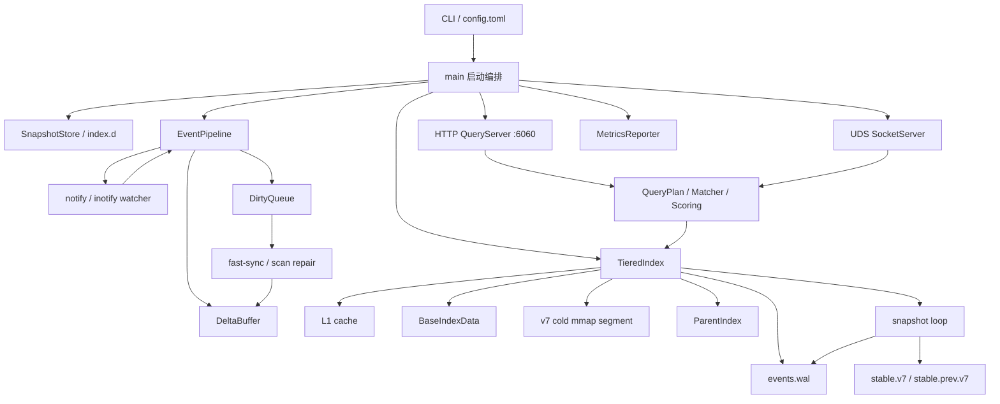

# fd-rdd 架构评审报告

> 面向对象：不阅读代码但需要判断架构合理性、工程取舍与风险边界的技术评审者。  
> 项目版本：v7.0.0 发布前状态，覆盖 v0.6.16 后续至 2026-05-30 的实现状态。
> 报告目标：把 fd-rdd 是什么、为什么这样做、关键模块如何协作、当前已验证到什么程度、还剩哪些风险讲清楚。

## 1. 一页结论

`fd-rdd` 是一个面向 Linux 桌面/开发机的文件名与路径索引守护进程。它的目标不是替代全文搜索，也不是做分布式索引，而是在用户态实现接近 Everything 的体验：常驻后台维护文件索引，HTTP/UDS 提供毫秒级查询，文件系统变化尽量实时反映，异常情况下可恢复。

核心结论：

- 它选择“常驻守护进程 + 增量索引”，是为了把 `fd` 这类每次全盘扫描工具的秒级/分钟级延迟，换成一次构建后持续维护的毫秒级查询。
- 它没有走内核驱动路线，而是使用用户态 inotify/notify，是为了降低部署、权限、安全和平台维护成本；同时承认 watcher 会丢事件，所以架构里内置 DirtyQueue、fast-sync、startup repair 和 rebuild 兜底。
- 它没有把全量索引常驻为大堆对象，而是把长期基座写成 v7 mmap snapshot，启动时以 manifest-only cold segment 挂载，metadata/posting 按需从 mmap 读取，降低冷启动和长期 RSS。
- 它把“最近变化”放进 DeltaBuffer，把“长期稳定基座”放进 BaseIndexData/cold mmap，把“预算受限的实时监听”放进 tiered watcher，把“可恢复一致性”放进 WAL + stable snapshot + DirtyQueue。
- 当前设计的本质不是一个单点优化，而是一组互相配合的约束系统：查询不阻塞、重建不中断、watcher 不可信、内存要可解释、冷启动不能 hydration、异常要有恢复路径。

一句话评价：fd-rdd 的架构方向是合理的。它不是追求“所有目录绝对实时、所有索引全在内存、所有事件绝不丢失”这种不可持续目标，而是把实时性、内存、恢复、观测和用户态约束放进同一个可运维模型里。

## 2. 项目定位

### 2.1 解决什么问题

在 Linux 上，常见文件搜索工具各有缺口：

| 工具 | 优点 | 缺口 |
|---|---|---|
| `fd` | 准确、无需 daemon | 每次重新扫描，项目大或 `$HOME` 大时延迟明显 |
| `fzf` | 交互体验好 | 依赖已有输入流，本身不维护系统级索引 |
| `plocate` | 查询快 | 定时更新，实时性弱 |
| Everything | 体验标杆 | Linux 上没有同等内核级 USN Journal 生态 |

fd-rdd 选择的产品定位是：在 Linux 用户态做一个“长期运行、可恢复、可观测”的文件名/路径索引服务。

### 2.2 明确非目标

这几点对评审很重要，因为很多架构取舍来自非目标边界：

- 暂不做文件内容全文索引。当前聚焦文件名、路径、扩展名、时间等 metadata 查询。
- 暂不索引文件夹作为查询结果。当前 `type:folder` 仍不返回结果。
- 不承诺 watcher 绝不丢事件。Linux inotify 在事件风暴、系统 watch 配额不足、目录创建竞态等情况下都可能漏，因此系统设计为“发现异常后补偿恢复”。
- 不做跨机器分布式一致性。当前是单机 daemon。
- 不默认使用高权限内核模块或驱动。部署和安全边界优先。

## 3. 需求约束与架构原则

fd-rdd 面对的是一个典型的“桌面实时索引”问题，但难点在于几个约束同时存在。

### 3.1 百万级文件规模

百万级文件会放大任何 per-file 开销：

- 一个 `PathBuf`、一个 `String` header、一个 HashMap bucket，看起来都不大，但乘以几十万/上百万后会直接变成百 MB 级别。
- posting list 如果用普通 `HashSet<FileKey>`，会被桶、指针、分配碎片放大。
- 查询若无候选裁剪，短 query 很容易退化为全量扫描。

架构原则：

- 用 `DocId(u32)` 替代直接把复杂 file key 放进 posting。
- 用 RoaringBitmap 存 posting，降低集合交集成本和内存体积。
- 用 PathTable/PathArena 类结构把路径字节连续化，减少 per-path heap 对象。
- 查询先做 anchor/trigram/ParentIndex 候选裁剪，再做精确 matcher。

### 3.2 文件系统事件不可靠

用户通常会假设“watcher 开了就一定实时”，但这在 Linux 用户态不成立：

- inotify watch 数有系统上限。
- recursive watch 不是内核原生单个 watch，而是要给子目录逐个挂 watch。
- 新目录创建和 watcher 生效之间存在竞态窗口。
- 批量操作如 git clone/npm install 会产生事件风暴。
- notify 可能给出 rescan 信号，说明可能丢事件。

架构原则：

- 正常路径依赖 watcher，但正确性不能只依赖 watcher。
- 所有“可能丢事件”的信号都进入 DirtyQueue。
- DirtyQueue 以目录 scope 做补扫，必要时扩大到父目录或全局。
- 启动时通过 stable snapshot、WAL replay、startup repair 和 full rebuild 兜底。

### 3.3 冷启动与 RSS

如果每次启动都把几百 MB 快照反序列化成堆对象：

- 冷启动会慢。
- RSS 会被索引大小直接定价。
- 断电恢复或坏快照会拖累启动路径。

架构原则：

- 持久化格式使用 mmap 友好的 v7 snapshot。
- 启动优先 cold mount，而不是把所有 entries 回灌到内存索引。
- metadata/postings 按需从 mmap 读取，用完后尽量 `MADV_DONTNEED`，降低 tmpfs/file-backed 页长期留在 RSS 的概率。
- MemoryReport 明确拆分 hot entries、manifest-only entries、cold mmap bytes、非索引匿名脏页等口径。

### 3.4 查询不能被维护任务阻塞

后台 snapshot、repair、scan、rebuild 都可能很重。用户体验要求：

- 查询不能因为 rebuild 期间索引清空而不可用。
- snapshot 不能在异步运行时里长时间阻塞。
- event storm 不应拖垮查询路径。

架构原则：

- 用 ArcSwap 持有当前可见索引版本，重建完成后原子切换。
- snapshot materialize 放到冷路径和 `spawn_blocking`。
- 普通事件只更新 DeltaBuffer/L2，不在每批事件后全量 materialize BaseIndex。
- 查询按“增量优先、新版本优先”合并，避免 snapshot 边界前的可见性缺口。

## 4. 总体架构

### 4.1 组件视图



### 4.2 启动流程

启动时的关键路径：

1. 解析 CLI 参数和 `~/.config/fd-rdd/config.toml`。
2. 首次启动必须显式指定 `--root`，避免无意扫描整个 `$HOME`。
3. 确定 snapshot 路径，默认在用户隔离的 runtime 目录下。
4. 优先加载 `stable.v7`，失败再试 `stable.prev.v7`，再试 legacy v7。
5. 如果 v7 可加载，则以 cold base 形式挂载；L2 保持为空增量层。
6. 打开 WAL 并 replay 未纳入 snapshot 的事件。
7. 若无可信快照、启动 repair 判断差异过大，或索引为空，则后台 full build。
8. 启动 watcher/event pipeline、DirtyQueue loop、tiered scan loop。
9. 启动 HTTP、UDS、snapshot loop、memory report loop、metrics JSONL reporter。
10. 退出时写 final snapshot 并记录 clean shutdown。

这里最关键的设计是：启动不要求“一定先把索引完整加载成内存对象”。只要有可信 v7，就可以 cold mount 后提供查询；如果需要修复，修复在后台逐步推进。

### 4.3 核心状态对象：TieredIndex

`TieredIndex` 是整个系统的中心对象，包含：

| 字段/模块 | 角色 |
|---|---|
| `L1Cache` | 查询结果热缓存，容量级别较小 |
| `l2: PersistentIndex` | 可变内存索引，承接 rebuild/full build 和兼容路径 |
| `DeltaBuffer` | 最新增量缓冲，按路径保留最新 Live/Deleted 状态，默认硬上限 256K |
| `BaseIndexData` | 当前查询基座，可来自内存 materialize，也可包含 v7 cold segment |
| `ParentIndex` | `parent:` / `infolder:` 查询的候选裁剪结构 |
| `DirtyQueue` | 所有补偿扫描的统一入口 |
| `WAL` | 事件追加日志，用于 snapshot 之后的恢复 |
| `RebuildState` | 后台重建状态，防止并发重建和频繁自激 |
| `StatsCollector` | 查询、事件、冷层校验、snapshot 等运行指标 |

一个容易混淆的点：代码历史里有 L1/L2/L3 索引分层，watcher 也有 L0/L1/L2/L3 目录分层。报告中把它们区分如下：

- 索引分层：查询数据结构的冷热层。
- watcher 分层：目录监听/扫描策略的冷热层。

## 5. 查询架构

### 5.1 查询入口

fd-rdd 对外提供两类查询入口：

- HTTP `/search`：适合 UI、脚本、服务集成。
- UDS `fd-rdd-query`：适合本机 CLI 和大结果集流式输出，避免 HTTP/JSON 聚合造成峰值。

HTTP 查询有几个保护：

- 默认 limit 100，最大 limit 10000。
- 查询任务放入 blocking pool，避免阻塞 tokio reactor。
- 查询超时 5 秒。
- `sort=size` 和 `size:` 已移除，传入会返回 400。
- 返回结果包括 `path`、`score`、`highlights`、`freshness`、`index_tier`、`validated`。

### 5.2 Query DSL

查询 DSL 支持：

- 文本匹配、glob、regex、fuzzy。
- AND/OR/NOT 组合。
- `ext:`、`doc:`、`pic:`、`video:`。
- `parent:` / `infolder:`。
- `depth:`、`len:`。
- `dm:` / `dc:` / `da:` 时间过滤。
- `type:file`；`type:folder` 目前不会命中，因为当前不索引目录。

设计原因：

- 单纯 substring 无法覆盖真实文件检索需求。
- DSL 允许把候选裁剪前移，例如 `parent:` 可直接走 ParentIndex。
- 严格拒绝已移除契约，比静默回退更利于 API 稳定性。

### 5.3 查询合并语义

查询结果按“最新状态优先”合并：

```text
DeltaBuffer Live/Deleted
    ↓ shadow by path and FileKey
BaseIndexData / cold mmap segment
    ↓ validate cold result if needed
SearchResult
```

关键语义：

- DeltaBuffer 中的 Live 结果优先于 base。
- DeltaBuffer 中的 Deleted 路径屏蔽 base 旧记录。
- overlay rename 的目标即使不匹配当前 query，也要用 FileKey shadow 旧路径，避免旧目录查询返回 rename 前的幽灵路径。
- base/cold 命中会进行冷层校验：`stat` 文件，确认是否仍存在、mtime/身份是否变化。
- 如果 cold 命中已删除，会写 tombstone 并把父目录加入 DirtyQueue。
- 如果 cold 命中发生变化，会返回当前 metadata，并把父目录加入 DirtyQueue。
- 如果路径形态 query miss，会推测可能的父目录并加入 DirtyQueue，解决“查询本身暴露索引缺口”的问题。

这是一个重要取舍：fd-rdd 不把冷层结果盲目视为绝对新鲜，而是在用户查询触达时做懒校验，并把校验结果反哺补偿队列。

### 5.4 排序和高亮

查询结果会经过评分：

- basename 命中权重高于深路径偶然命中。
- 边界匹配有加分，例如 `.`、`-`、`_`、CamelCase 边界。
- 深度更多作为 tie-breaker，而不是绝对主导。
- `node_modules` 等依赖目录不再只靠查询降权，默认已在索引入口排除。

设计原因：文件搜索体验不是“返回所有匹配”这么简单。用户通常希望最相关、最像目标文件名的结果排在前面，尤其在大型项目中，深层依赖目录会制造大量噪音。

## 6. 索引数据结构

### 6.1 FileKey 与 DocId

文件身份使用 `FileKey`，主要由设备号、inode、generation 组成。路径只是可变属性，不是唯一身份。

为什么不只按路径：

- rename 后路径变了，但文件身份可能不变。
- delete + recreate 可能路径相同但身份不同。
- inode 复用会造成幽灵文件，需要 generation 辅助识别。

posting 内部用 `DocId(u32)`，不是直接塞 `FileKey`：

- `u32` 更小，适合 bitmap。
- RoaringBitmap 能高效做交集。
- DocId 作为紧凑表下标，减少 HashMap 和指针成本。

### 6.2 PathTableV2 / FileEntry

当前运行时和 v7 快照逐步收敛到：

- `FileEntry` 保存 dev、ino、generation、path_idx、mtime_ns。
- `PathTableV2` 保存路径字节。
- 旧的 `CompactMeta + PathArena` 保留为历史快照兼容，不再作为主要热路径。
- v7 version 2 删除公开 `size` 契约后，FileEntry 从旧 40B entry 兼容到新 32B entry。

为什么这么做：

- 路径是内存大头，必须集中管理。
- 每条 entry 的固定大小要尽量小。
- size 对文件名索引不是核心，保留会放大常驻体积和 API 兼容负担。

### 6.3 Trigram / RoaringBitmap

trigram 索引用于把文本查询转成候选集合：

- query 拆成三字节窗口。
- 取多个 posting 的交集。
- 候选再进入精确 matcher。

近期实现将部分索引改为 basename-only 候选以压缩常驻体积；同时新写 v7 会持久化完整路径 trigram posting 与 sentinel，保证 manifest-only cold segment 查询目录组件时不漏。旧段若无法证明 posting 完整，则回退全段精确过滤。

这体现了一个保守原则：性能优化不能引入 false negative。宁可在能力不足时回退慢路径，也不能漏结果。

### 6.4 ParentIndex

`parent:` / `infolder:` 是文件搜索里非常常见的约束。如果没有 ParentIndex，只能全量扫描路径父目录。

ParentIndex 做的事：

- parent directory -> direct child doc ids。
- 查询某个父目录时直接拿候选，不扫全库。
- 运行时表示已从小 Roaring 对象收敛为排序 `Vec<u32>`，减少大量小堆分配。

设计原因：父目录过滤是高价值高频过滤，值得单独建索引。

## 7. 事件处理架构

### 7.1 正常事件路径

```text
notify event
  → priority/normal channel
  → debounce window
  → ignore/exclude filter
  → merge and normalize
  → WAL append
  → DeltaBuffer apply
  → L2 apply
  → L1 invalidation
  → snapshot later materializes base
```

关键点：

- channel 有界，默认容量 65536。
- Create 事件可走更短 debounce，降低新文件可见延迟。
- 事件先写 WAL，再应用到内存结构；WAL 是 best-effort durability，默认不是强事务数据库日志。
- DeltaBuffer 按路径去重，只保留最新状态。
- 删除、rename 会让 L1 对应缓存失效。
- 普通事件不触发全量 base materialize，避免每批事件都重建 40 万/80 万条基座。

### 7.2 DeltaBuffer

DeltaBuffer 是统一增量缓冲区：

- key 是路径 bytes。
- value 是 `Live(EventRecord)` 或 `Deleted`。
- Create/Modify -> Live。
- Delete -> Deleted。
- Rename -> old path Deleted + new path Live。
- 默认硬容量上限 262144。

为什么要有 DeltaBuffer：

- 旧设计中 overlay_state、pending_events 等多套增量结构容易产生语义分裂。
- 按路径保留最新状态，能自然压缩事件风暴。
- 硬容量上限能避免事件堆积拖垮内存。
- snapshot 边界再把 DeltaBuffer materialize 到 base，冷路径承担重活。

### 7.3 PendingMoveMap

文件 rename 在事件层可能拆成多个事件，甚至跨批次到达。PendingMoveMap 用于短时间缓存 rename from/to，尽量把 rename 识别为身份连续变化，而不是 delete + create 的偶然组合。

设计原因：

- rename 是文件搜索一致性的高风险场景。
- 如果处理不好，会出现旧路径幽灵、新路径不可见、同一文件多条记录等问题。

### 7.4 溢出与 rescan 信号

当 notify 提示需要 rescan，或事件风暴导致可能丢事件，fd-rdd 不假装一切正常，而是：

- 记录 overflow/rescan 指标。
- 把对应 scope 加入 DirtyQueue。
- 优先局部 fast-sync。
- 必要时升级到全局 rebuild。

这是一条非常关键的架构边界：事件流是性能优化路径，不是唯一正确性来源。

## 8. DirtyQueue 与补偿一致性

DirtyQueue 是 fd-rdd 近期架构里最重要的收敛点之一。

### 8.1 DirtyQueue 来源

DirtyQueue 接收以下来源：

| 来源 | 原因 |
|---|---|
| InotifyEvent | 冷层目录发生事件，需要补扫确认 |
| QueryHitStale | 查询命中后校验发现删除/变化 |
| QueryMiss | 路径形态查询 miss，可能是索引没补上 |
| PeriodicColdScan | L1/L2/L3 冷层周期扫描 |
| StartupRepair | 非干净退出或启动状态不可信 |
| OverflowRecovery | watcher 明确可能丢事件 |

### 8.2 DirtyQueue 行为

- 按目录 scope 去重。
- 有 debounce，避免重复事件立即触发扫描风暴。
- 有 priority：overflow > stale hit/startup repair > 普通事件 > periodic scan。
- 失败后指数退避并扩大 scope 到父目录。
- 超过重试次数后保守失败，等待后续更高层恢复。

为什么这样做：

- 所有“不确定”都统一进入一套补偿机制，而不是散落在事件、查询、启动、watcher 各处。
- 局部目录补扫比全量 rebuild 便宜得多。
- 失败扩大 scope 是为了处理目录 rename、权限变化、父目录 mtime 不一致等边界。

## 9. 持久化与恢复

### 9.1 v7 snapshot

v7 是当前核心持久化格式。它是单文件 mmap-friendly snapshot，包含：

| Segment | 内容 |
|---|---|
| PathTable | 路径字节表 |
| EntriesByKey | 按文件身份组织的 entry |
| EntriesByPath | 按路径组织的 entry |
| TrigramIndex | trigram -> roaring posting |
| ParentIndex | parent -> children |
| Tombstones | 删除屏蔽信息 |

格式特点：

- 固定 header。
- segment descriptor。
- 每段 CRC32C。
- trailer 和 global checksum。
- v7 version 2 使用 32B FileEntry；兼容 version 1 的 40B entry。

为什么不是 serde/bincode 直接 dump：

- 直接反序列化会强制 hydration。
- mmap 需要稳定的段式布局。
- 分段校验可以更快定位损坏。
- format evolution 需要版本兼容。

### 9.2 stable snapshot 轮转

稳定恢复使用：

- `stable.v7`
- `stable.prev.v7`
- `stable.next.v7` 写入中间态

写入采用 tmp/next + fsync + rename 的原子策略。启动时优先 stable，再回退 stable-prev，再回退 legacy v7。

为什么要轮转：

- 断电或进程被 kill 时，当前写入中的 snapshot 可能损坏。
- 上一个稳定版本可以作为兜底。
- 只要有一个可加载快照，就可以先提供查询，再后台 repair。

### 9.3 WAL

WAL 是追加事件日志：

- 当前文件：`events.wal`。
- snapshot 边界 seal 成 `events.wal.seal-*`。
- replay 读取 checkpoint 之后的 sealed WAL + 当前 WAL。
- record 有长度和 CRC，尾部损坏可截断。

需要注意：当前 WAL 默认 durability 是 flush-only，可配置更强 `sync_data`，但设计上不把它包装成完整数据库事务日志。它的职责是缩小 snapshot 之后的恢复窗口，而不是替代 snapshot。

### 9.4 启动恢复决策链

```text
try stable.v7
  → try stable.prev.v7
  → try legacy v7
  → mount cold base if any
  → replay WAL
  → if previous shutdown unclean or WAL tail truncated: startup repair
  → if empty/escalated: background full build
```

这条链路的目标不是“启动时立即证明全局完全一致”，而是：

- 尽快恢复一个可查询的基座。
- 把不可信范围标记出来。
- 用 repair/DirtyQueue/rebuild 把系统拉回一致状态。

## 10. Watcher 架构

### 10.1 三种模式

| 模式 | 行为 | 适用场景 |
|---|---|---|
| `recursive` | 对 roots 递归注册 watcher | 小到中等目录，追求简单实时 |
| `tiered` | 预算受控，只把热点目录放入 L0 实时 watcher，冷目录用扫描补偿 | 大 `$HOME`、目录多、inotify 配额有限 |
| `off` | 不启动 watcher，只靠 snapshot 和手动 `/scan` | 只读或低 RSS 场景 |

默认仍是 recursive，以保证传统直觉；tiered 是更适合大规模桌面/开发机的策略模式。

### 10.2 Tiered Watcher 分层

```text
L0: 实时 inotify 递归 watcher
L1: warm scan，较高频补扫
L2: cold scan，低频补扫
L3: eventually consistent，极低频或 query validate 触发
```

TieredWatchRuntime 维护：

- 每个目录的 tier。
- watch_cost。
- event_score。
- dirty/freshness。
- next_scan_unix_secs。
- promotion/demotion pending。
- budget blocked 统计。
- high priority scan 标记。

目录会因事件变热而晋升，因连续空扫而降级；预算满时可以把低价值 L0 替换给更热目录。

### 10.3 为什么要 tiered watcher

Linux recursive watcher 的真实成本是“目录数”，不是文件数，也不是排除规则后的扫描文件数。一个 `$HOME` 里可能有几十万文件和大量子目录，尤其是：

- `node_modules`
- `.git`
- package cache
- build output
- media/archive/NAS mount

全递归 watcher 的问题：

- inotify watch descriptor 可能耗尽。
- notify 内部和事件管道常驻内存上升。
- 不活跃目录也占用实时监听预算。

tiered watcher 的核心取舍：

- 最热、最重要的目录进入 L0，保证实时。
- 其他目录不承诺实时，而是通过 DirtyQueue、周期扫描、查询校验维持最终一致。
- 用户可以用 strict profile 指定必须实时覆盖的目录。

### 10.4 strict / balanced / low_power profile

profile 用于显式表达一致性与资源成本：

- `balanced`：默认策略，兼顾实时性和成本。
- `strict`：要求 `strict_required_hot_dirs` 全部进入 L0。
- `low_power`：更保守地使用 watcher/扫描预算。

strict 模式下：

- 默认 required hot dirs 包括 Downloads、Documents、Desktop、Music、Pictures、Videos。
- 如果 required watch cost 超过预算，`/watch-state` 会输出 shortfall 和 uncovered dirs。
- 若 `strict_fail_on_budget_exceeded = true`，`/health` 会返回 degraded；否则是 warning。

这让“哪些目录必须实时”变成可配置、可观测、可审计的契约。

### 10.5 Ephemeral Watch

Ephemeral Watch 是临时 watcher 租约：

- 当某个 dirty scope 短时间重复触发，但不适合长期晋升 L0，可申请临时 watcher。
- 它有独立预算，不计入 L0/L1/L2/L3。
- 满足 TTL、idle、连续无变化、被 L0 覆盖或低价值驱逐时自动移除。

为什么需要它：

- 有些目录短时间很活跃，例如一次解压、一次 git checkout、一个下载目录爆发。
- 长期晋升会浪费预算，但完全靠扫描会延迟高。
- 临时租约是在实时性和资源之间的中间档。

## 11. 内存与性能设计

### 11.1 内存来源拆分

fd-rdd 特别强调内存可解释，因为历史上“RSS 不降”容易被误判为泄漏。实际可能来源包括：

- hot BaseIndexData。
- DeltaBuffer。
- L1 cache。
- cold mmap 被触页后的 file-backed RSS。
- event pipeline 的 Vec/HashMap capacity 高水位。
- allocator arena high-water。
- watcher 内部结构。
- 非索引匿名脏页。

因此系统提供 `/memory`，并在 metrics JSONL 中持久化 memory snapshot。

### 11.2 降低内存的关键设计

- 默认排除 `.git`、`node_modules`、`target`、`dist`、cache/vendor 等目录，并在索引入口而非查询降权阶段排除。
- v7 cold mount，不启动即 hydration。
- PathTableV2 压缩路径表示。
- FileEntry v2 移除 size，降低固定 entry 大小。
- ParentIndex 用排序 `Vec<u32>` 替代大量小 Roaring 对象。
- DeltaBuffer 有硬容量上限。
- 周期 snapshot 有最小事件数/字节数门槛，避免少量事件反复 materialize 大 base。
- snapshot/flush 后执行 allocator trim。
- v7 mmap 校验和冷查询后执行 `MADV_DONTNEED`。

### 11.3 已有性能证据

当前仓库记录的压测数据：

- `p2_large_scale_hybrid` 覆盖 80 万文件混合工作区。
- initial_indexing CPU 峰值约 125%。
- CPU >= 100% 持续约 2034ms。
- RSS 峰值约 237680KB。
- v0.6.14 后真机 tiered watcher 在约 44.5 万文件索引下，启动 RSS 约 96-97MB，运行一段时间约 97-98MB，明显低于 recursive watcher 的 260MB+ 常驻区间。

这些数据还不是完整发布级 benchmark，但已经说明架构方向有效：大规模场景下，热点 watcher + cold mmap + 默认排除 + 延迟 materialize 能明显压低常驻内存。

## 12. 对外接口与可观测性

### 12.1 HTTP API

| Endpoint | 用途 |
|---|---|
| `/search` | 查询文件路径，支持 DSL/fuzzy/sort/order/limit |
| `/status` | 索引数量、是否重建 |
| `/health` | 健康状态、watcher 降级、strict coverage、WAL/recovery 状态 |
| `/memory` | RSS/smaps/index/cold mmap/overlay/event pipeline 拆项 |
| `/watch-state` | tiered watcher 状态、预算、层级、dirty/cold 计数 |
| `/debug/tiered-watch` | 单目录/全局 watcher debug dump |
| `/metrics` | StatsReport JSON |
| `/scan` | 手动扫描指定路径 |
| `/trim` | 手动触发 RSS/allocator 回吐 |

### 12.2 UDS

UDS 查询用于本机 CLI：

- 避免 HTTP/JSON 聚合大结果集。
- 更适合 shell 工具集成。
- socket 默认位于用户隔离 runtime 目录。

### 12.3 Metrics JSONL

MetricsReporter 每 30 秒写出结构化诊断快照，包含：

- watch state。
- runtime stats。
- memory stats。
- health snapshot。
- diagnostics。

设计原因：

- 线上/本机长期运行问题往往不是瞬时 API 能解释的。
- JSONL 方便后续 jq、图表和 sim 输入。
- 保留旧 `/watch-state` 顶层字段，降低脚本迁移成本。

## 13. 测试与质量保障

仓库测试覆盖按层次组织：

| 测试类别 | 文件示例 | 覆盖重点 |
|---|---|---|
| 存储兼容 | `p0_storage_compat.rs` | v2-v7 snapshot、WAL 兼容 |
| 分配器/内存 | `p0_allocator.rs` | RSS/allocator 观测 |
| 查询 | `p1_query.rs` | DSL、过滤、排序、边界 |
| 事件处理 | `p1_event_processing.rs` | debounce、事件合并、可见性 |
| 真实 watcher | `p1_real_watcher.rs` | create/rename/delete 真实链路 |
| API E2E | `p1_api_e2e.rs` | HTTP/UDS daemon 端到端 |
| crash/recovery | `p1_crash_recovery_matrix.rs`、`p1_poweroff_resume.rs` | abrupt kill、坏快照、启动修复 |
| WAL/recovery | `p1_wal_recovery.rs`、`p1_snapshot_recovery.rs` | WAL replay、stable snapshot fallback |
| ignore/symlink | `p1_ignore_rules.rs`、`p1_symlink_safety.rs` | 排除规则、安全边界 |
| 大规模 | `p2_large_scale_hybrid.rs` | 80 万文件、git clone、npm install、CRUD |

CI workflow 包括：

- 常规 CI。
- stress memory。
- stress boundary。
- stress large-scale。
- stress hybrid large-scale。
- stress musl。
- benchmark workflow。

质量策略不是只靠单元测试，而是把真实 daemon、真实 watcher、坏快照、断电恢复、大规模工作区都纳入回归。

## 14. 关键设计取舍

### 14.1 为什么不是每次查询直接扫描

直接扫描简单，但不满足毫秒级体验。大型 `$HOME` 或 monorepo 下，一次查询可能扫几十万文件。fd-rdd 用常驻索引换取低查询延迟。

代价：

- 需要 daemon。
- 需要处理一致性和恢复。
- 需要内存控制。

这个代价是项目存在的核心理由。

### 14.2 为什么不是全量常驻内存索引

全量常驻会让查询简单，但 RSS 随索引规模线性增长，并且冷启动慢。fd-rdd 用 v7 cold mmap 把长期基座放到文件映射里，需要时按页读取。

代价：

- 冷层查询可能触页。
- 需要校验 freshness。
- mmap file-backed RSS 需要专门观测。

收益：

- 冷启动快。
- 常驻内存低。
- 坏段可检测。

### 14.3 为什么不是只用 snapshot，不用 WAL

只用 snapshot 会丢失最后一次 snapshot 之后的事件窗口。WAL 可以把恢复窗口缩小到已 append 事件。

代价：

- 需要处理 WAL 截断尾、版本兼容、seal 清理。
- 默认 flush-only 不等于强事务。

收益：

- 非干净退出后可 replay 近期事件。
- snapshot 间隔可以更长，减少频繁 materialize。

### 14.4 为什么不是只用 WAL，不做 snapshot

长期 WAL replay 会越来越慢，而且无法提供 mmap-friendly cold base。snapshot 是基座，WAL 是增量恢复。

### 14.5 为什么不是全部目录实时 watcher

在 Linux 上递归 watcher 的真实成本是目录数，配额和内存都可能顶不住。全部实时会把低价值冷目录和高价值热目录等价对待。

tiered watcher 的取舍：

- 热目录实时。
- 冷目录最终一致。
- strict profile 允许用户声明必须实时的目录。

### 14.6 为什么不直接上 fanotify

fanotify 更接近内核级方案，但权限、语义、可移植性、复杂度都更高。当前项目先把用户态 notify 的补偿闭环做完整，fanotify 延后评估。

### 14.7 为什么默认排除依赖/构建/cache 目录

这些目录会制造巨大文件量和事件量，但对“日常找自己文件”的价值低：

- `.git`
- `.cache`
- `.cargo`
- `.npm`
- `.pnpm-store`
- `.yarn`
- `node_modules`
- `target`
- `dist`
- `build`
- `vendor`

排除发生在索引入口，而不是查询排序阶段，因为根本不索引才真正减少 RSS、watcher 成本和事件噪音。

## 15. 当前风险与边界

### 15.1 一致性边界

fd-rdd 是最终一致系统，不是强一致数据库。

风险：

- watcher 丢事件后，在 DirtyQueue 处理前可能短暂 stale。
- L3 目录不是实时覆盖。
- query validate 可以发现并修正 stale，但只有被查询触达时才发生。

缓解：

- `/health`、`/watch-state` 显示 tiered degraded/EventuallyConsistent。
- strict profile 可要求关键目录实时覆盖。
- DirtyQueue 和 startup repair 持续补偿。

### 15.2 WAL durability 边界

默认 WAL 是 flush-only。极端断电下，已写入用户态缓冲但未落盘的数据仍可能丢。

缓解：

- stable snapshot 轮转。
- startup repair。
- WAL tail checksum 和截断。
- 可进一步引入更强 fsync 策略作为配置。

### 15.3 冷层查询成本

manifest-only cold segment 降低常驻内存，但某些查询可能触发 mmap 读取，甚至旧段能力不足时回退全段精确过滤。

缓解：

- ColdNameFilter。
- full-path trigram posting + sentinel。
- `MADV_DONTNEED`。
- 后续可继续做更强段级过滤/统计。

### 15.4 Benchmark 体系还可加强

已有压力测试和局部指标，但发布级 benchmark 表仍不完整。

建议：

- 固定硬件/数据集持续采集启动时间、RSS、查询延迟、事件恢复时间。
- 将 sim report、metrics JSONL 和 benchmark 汇总成长期趋势。

### 15.5 macOS/Windows

当前设计主平台是 Linux。macOS 标注实验性，Windows 暂无完整计划。跨平台 watcher 语义差异很大，不能简单承诺。

## 16. 后续路线建议

优先级从高到低：

1. 完善发布级 benchmark：固定数据集、固定脚本、固定指标，把性能讨论从经验转为曲线。
2. 强化 WAL 策略：可配置 fsync policy、序列号去重、gap verify。
3. 继续优化 cold segment 过滤：减少无效 mmap 触页和旧段全扫回退。
4. 将 metrics report 接入 fd-rdd-sim，形成“真实运行数据 -> 策略推荐 -> TOML patch”的闭环。
5. 明确目录索引和全文索引是否进入路线；如果进入，需要单独设计，不应混入当前文件名索引热路径。
6. 评估 fanotify 的收益/成本，但不要破坏当前用户态可靠性闭环。

## 17. 给评审者的检查问题

建议评审围绕以下问题判断架构质量：

1. 是否接受“用户态 watcher 不可靠，因此系统是最终一致 + 补偿恢复”的前提？
2. 是否认可 v7 mmap cold base 相比全量 hydration 的内存/冷启动收益？
3. 是否认可 DeltaBuffer 作为统一增量层，避免 overlay/pending 多语义分裂？
4. strict/balanced/low_power 是否足够表达用户对实时性和资源的不同诉求？
5. 当前 `/health`、`/watch-state`、`/memory` 是否能让运维者解释“为什么没有实时”“为什么 RSS 高”“为什么正在补偿”？
6. WAL 默认 flush-only 是否符合项目定位，还是应提高默认 durability？
7. 默认排除 `.git/node_modules/target` 等目录是否符合目标用户预期？
8. 当前不索引目录、不做全文搜索的边界是否需要在产品层更明确？

## 18. 最终评审意见草案

可以给出的综合判断：

fd-rdd 的架构不是简单的“文件列表缓存”，而是一个围绕 Linux 用户态文件索引约束搭建的分层系统。它在几个关键问题上做了正确取舍：

- 承认 watcher 不可靠，并把补偿机制设计成一等公民。
- 承认全量常驻索引不可持续，因此用 mmap cold base 和按需读取降低 RSS。
- 承认桌面目录冷热差异巨大，因此用 tiered watcher 和 strict profile 显式管理实时性预算。
- 承认异常恢复不可避免，因此用 stable snapshot、WAL、startup repair 和 rebuild 形成恢复链。
- 承认可运维性重要，因此把 memory、watch state、health、metrics 都做成可查询接口。

当前主要不足不在总体方向，而在工程成熟度继续打磨：发布级 benchmark、WAL durability 策略、cold segment 过滤和跨平台边界仍需要持续完善。整体看，这是一套方向清晰、约束意识强、演进路径合理的架构，适合作为 Linux 用户态即时文件搜索 daemon 继续推进。
